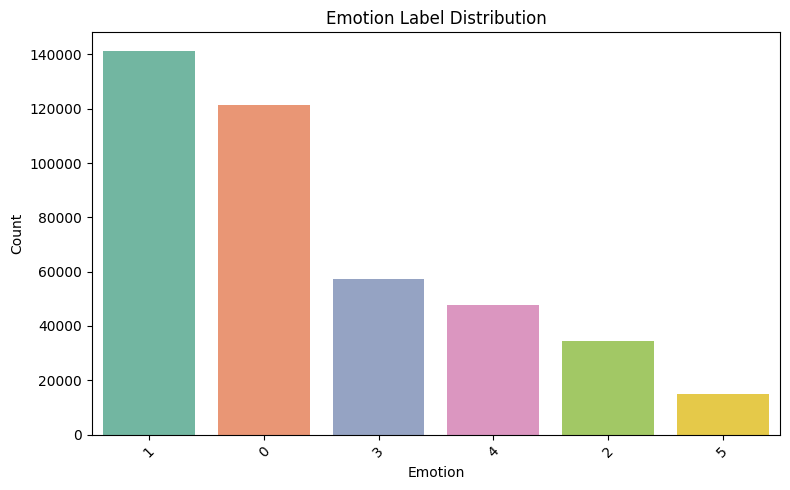
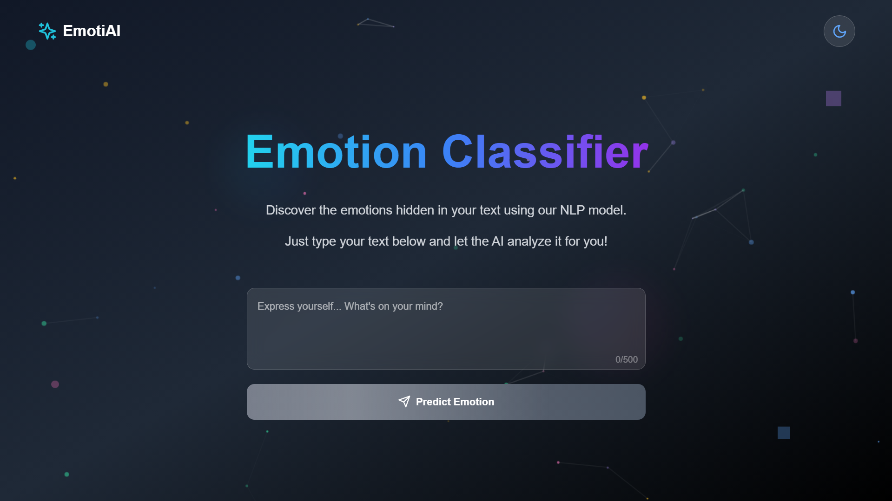
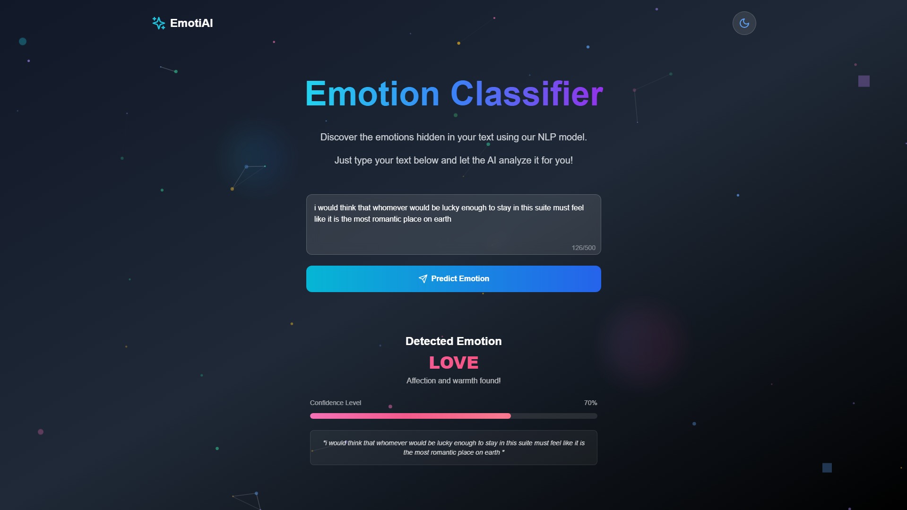

# 😄 Emotion Classification using NLP & Machine Learning

This repository provides a complete solution for classifying emotions from text using NLP, classical ML, and deep learning. The system includes:

- Data loading and preprocessing
- Exploratory Data Analysis (EDA)
- Model training (Logistic Regression, SVM, XGBoost, CNN)
- Model selection (best: XGBoost)
- Flask-based REST API
- React/Next.js-based GUI

---

## 🔗 Dataset

- Source: [Kaggle - Emotions Dataset](https://www.kaggle.com/datasets/bhavikjikadara/emotions-dataset)
- Emotions: sadness (0), joy (1), love (2), anger (3), fear (4), and surprise (5)
- Raw data in: `data/emotions.csv`

---

## 🧠 Final Model: XGBoost

- Accuracy: 89.51%
- F1 Score: 86.51%
- Vectorizer: TF-IDF with 10,000 features
- Saved files:
  - `xgboost_model.pkl`
  - `tfidf_vectorizer.pkl`
  - `label_encoder.pkl`

---

## 📊 EDA Example

- Class distribution:
  

---

## 🖼️ GUI Snapshots

- Home Page:
  

- Result Page:
  

---

## 🧪 Project Structure

```
emotion-classification-nlp/
├── data/
├── model/            # Flask API + model files
├── notebooks/        # Jupyter notebooks
├── ui/               # Next.js frontend
├── requirements.txt
├── requirements-dev.txt
└── README.md
```

---

## ⚙️ Installation & Usage

### Backend (Flask)
```bash
pip install -r requirements.txt

cd model
python app.py
```

### Frontend (Next.js)
```bash
cd ui
npm install --legacy-peer-deps
npm run dev
```

---

## 📦 Requirements

### requirements.txt
```
flask
flask-cors
numpy
joblib
```

### requirements-dev.txt
```
numpy
pandas
matplotlib
seaborn
scikit-learn
xgboost
tensorflow
keras
joblib
kagglehub
```

---

## 🔮 API (POST /predict)

Send JSON like:
```json
{
  "text": "I feel amazing today!"
}
```

Returns:
```json
{
  "emotion": "joy",
  "confidence": 0.87
}
```

---

## ✅ Future Scope

- Support more languages
- Deploy using Docker/Vercel/Render
- Add user login + emotion history

---

## 🙏 Credits

- Dataset by Bhavik Jikadara on Kaggle
- UI inspired by modern AI apps

---

> Built with ❤️ by [Tilak Devi]